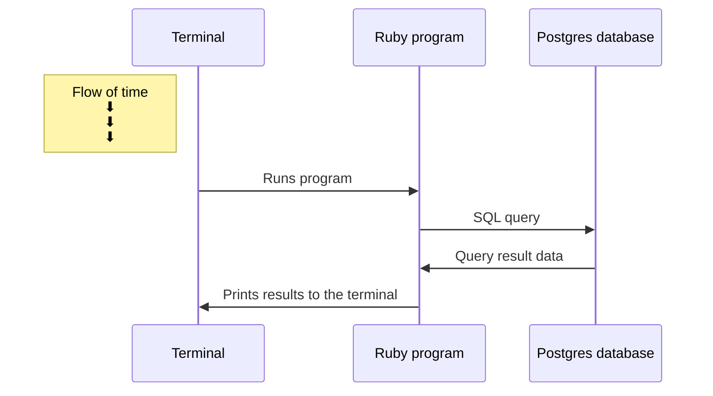
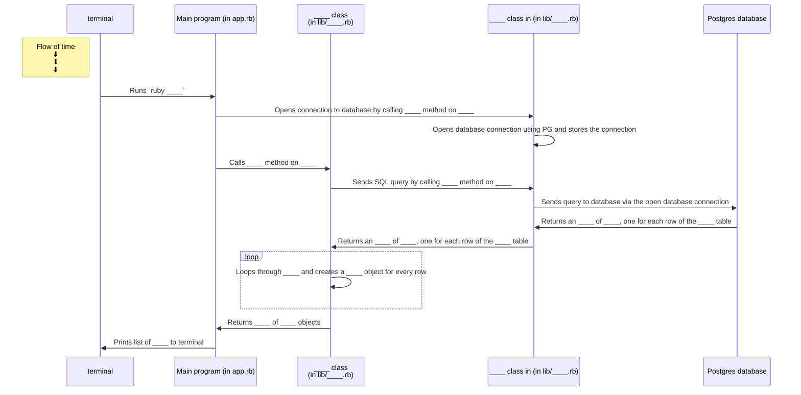
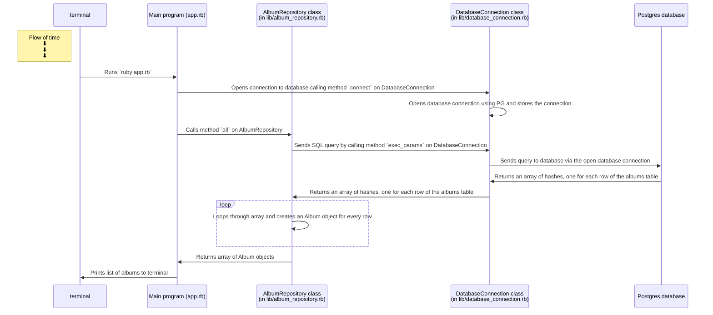

# Creating a sequence diagram for a database-backed program

In this section, you will step away from the code for a bit and learn how to build sequence diagrams to communicate what how your program is working.

Why should you bother with this? 

As you've probably noticed, the number of files in your codebase has grown considerably compared to codebases you were working with in previous exercises. In real applications, codebases can easily contain hundreds or even thousands of files. No one can hold all that information in their head at once.

 * A diagram is easier to digest, present and discuss than a whole program made of written code. It is also easier to modify if it's needed.
 * It will force you to think deeper about what is happening in your program, and to explain to yourself (and your peers) how the different components of the app is working. This will become very useful when it comes to debugging too.

**A sequence diagram** for a database-backed program helps us to explain and communicate two important things:
 * The interaction between the different components of the program and the database
 * The order in which the different parts interact together

Here is an example:

On the sequence diagram above, we can see that:
 * the two main components of our system are the ruby program and the database
 * the two interactions happening between them are the sending of SQL queries from the program to the database and the returning of query results from the database to the program
 * The SQL query is sent to the database by the program, and then the results are sent back by the database
 
> **Note** : the database and the terminal are technically not a parts of our program, but they are part of the broader "system" the program lives in - therefore it is still important to include them.

## Exercise

The diagram presented above presents what happens in database-backed program at a high level. We can "zoom in" as needed, to illustrate more low level details. Here is a template of a more detailed sequence diagram for the program that prints out albums that you wrote in the [previous step](./02_test_driving_model_repository_classes.md#exercise).
However, some important information has been left out.

Using the codebase for that exercise, fill in the gaps in this diagram.

    
<b>Solution</b>

<!-- OMITTED -->

> If the diagram doesn't render well inside this box, click the "<->" button in top right corner to expand it.

Note that the `Album` class does not appear in the top line of boxes in this diagram. 
That's because it's not really an _actor_ in a program. 
It's just a container to hold the data for each album.

## Challenge

This is a process feedback challenge. That means you should record yourself doing it and
submit that recording to your coach for feedback. [How do I do
this?](https://github.com/makersacademy/golden-square/blob/main/pills/process_feedback_challenges.md)

> **Note**: For this challenge, record yourself as you talk through your finished diagram (there is no need to record yourself as you create the diagram). As part of your submission, please upload an image file with your diagram as well as your recording.

Create a similar sequence diagram to the one above for the. Make sure your diagram includes all of the [challenge you completed in the previous section](./02_test_driving_model_repository_classes.md#challenge). Make sure your diagram includes the following:

 * The terminal 
 * The main program (`app.rb`)
 * The repository class
 * The database connection class
 * The database

You can create these diagrams in the diagramming tool of your choice but a nice one for creating sequence diagrams specifically is [diagram.codes](https://playground.diagram.codes/d/sequence).

[After you're done, submit your recording and diagram here](https://airtable.com/shrNFgNkPWr3d63Db?prefill_Item=db_as02_v2).

[Next Challenge](04_designing_schema_one_table.md)

<!-- BEGIN GENERATED SECTION DO NOT EDIT -->

---

**How was this resource?**  
[😫](https://airtable.com/shrUJ3t7KLMqVRFKR?prefill_Repository=makersacademy%2Fdatabases&prefill_File=challenges%2F03_creating_sequence_diagrams.md&prefill_Sentiment=😫) [😕](https://airtable.com/shrUJ3t7KLMqVRFKR?prefill_Repository=makersacademy%2Fdatabases&prefill_File=challenges%2F03_creating_sequence_diagrams.md&prefill_Sentiment=😕) [😐](https://airtable.com/shrUJ3t7KLMqVRFKR?prefill_Repository=makersacademy%2Fdatabases&prefill_File=challenges%2F03_creating_sequence_diagrams.md&prefill_Sentiment=😐) [🙂](https://airtable.com/shrUJ3t7KLMqVRFKR?prefill_Repository=makersacademy%2Fdatabases&prefill_File=challenges%2F03_creating_sequence_diagrams.md&prefill_Sentiment=🙂) [😀](https://airtable.com/shrUJ3t7KLMqVRFKR?prefill_Repository=makersacademy%2Fdatabases&prefill_File=challenges%2F03_creating_sequence_diagrams.md&prefill_Sentiment=😀)  
Click an emoji to tell us.

<!-- END GENERATED SECTION DO NOT EDIT -->
