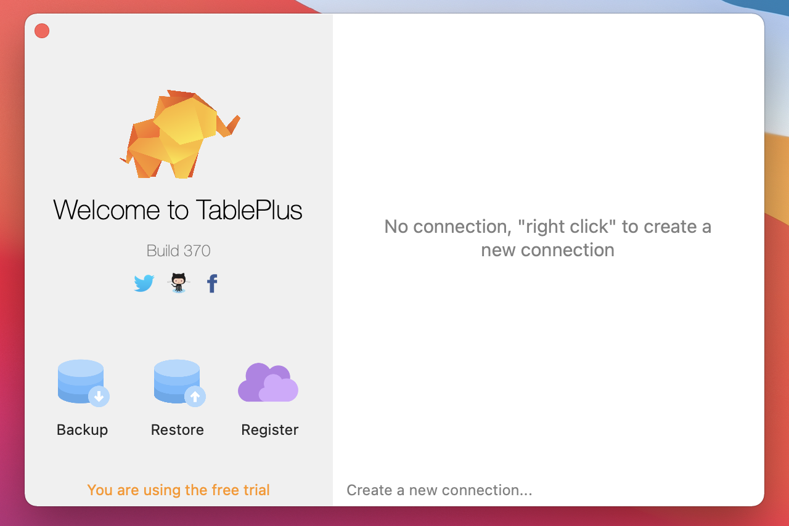
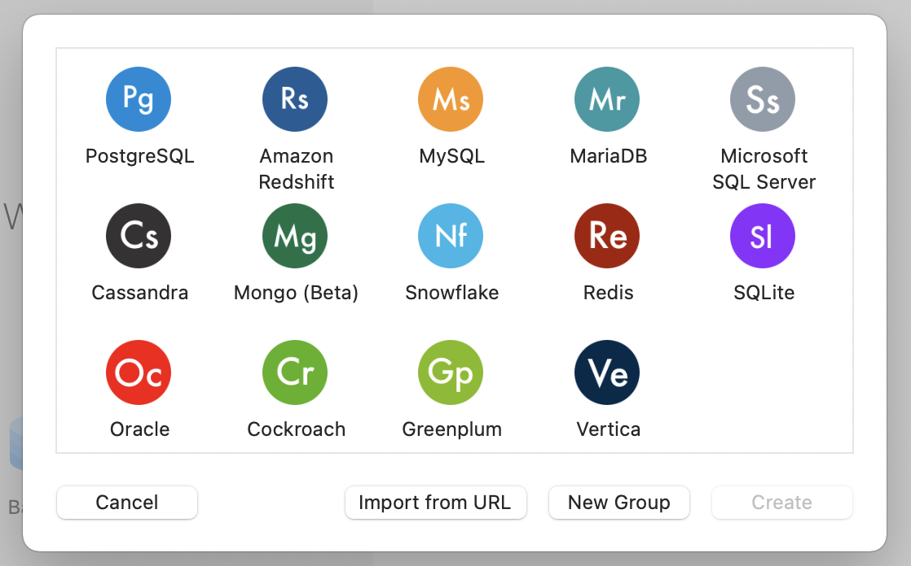
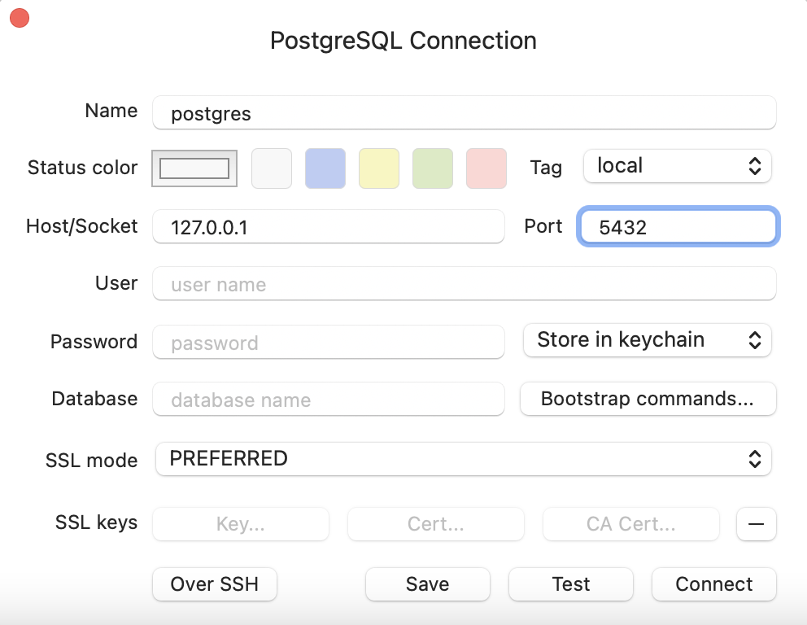
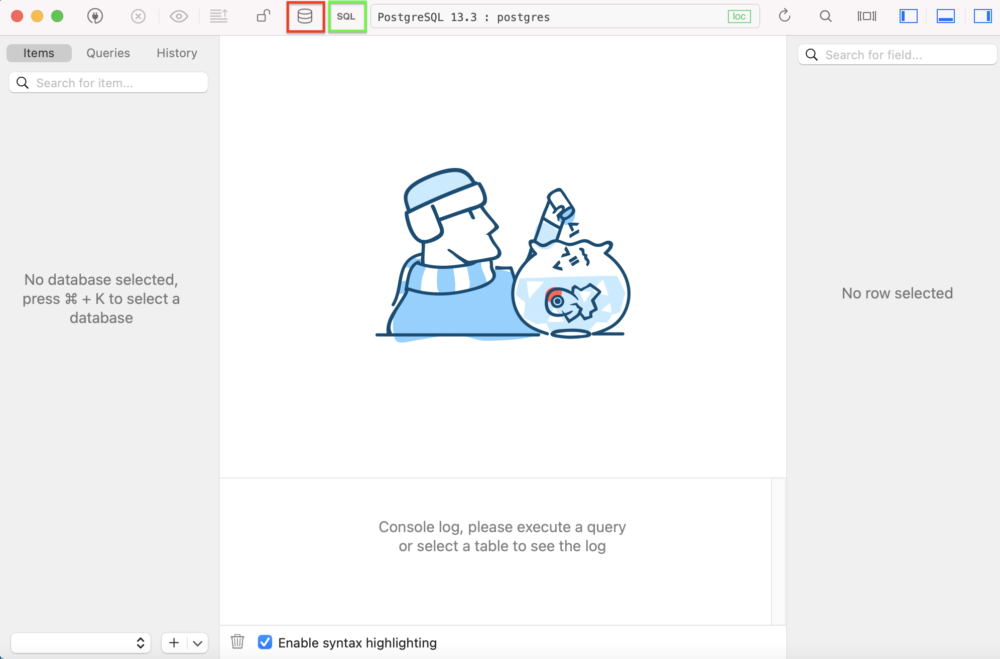

# Using TablePlus

_**This is a Makers Bite.** Bites are designed to train specific skills or
tools. They contain an intro, a demonstration video, some exercises with an
example solution video, and a challenge without a solution video for you to test
your learning. [Read more about how to use Makers
Bites.](https://github.com/makersacademy/course/blob/main/labels/bites.md)_

Learn to use a graphical interface to navigate and interact with a database.

## Installing TablePlus

It's hard to get a good picture of a database just using `psql`. That's why several programs offer a Graphical User Interface ('GUI') to databases.

One such tool is TablePlus. To install the program:

- [Download TablePlus](https://tableplus.com/).
- Drag the TablePlus app into your `/Applications` directory.
- Double-click to start it.

## Connect TablePlus to your PostgreSQL

TablePlus needs to know some details about your Postgres server. In particular, it needs to know:

- Where it is — this would be `127.0.0.1`
- What login details are required — your system username
- What database it should start with — the `music_library` database.

When you first open Table Plus, you'll be met by this screen.

Go ahead and right click, then choose new, or select 'Create new connection...' at the bottom of the window. You should now see this.

As you can see, TablePlus works with lots of different types of database so it'll be quite useful to you from now on! Since we're working with Postgres today, select PostgreSQL and then click on 'Create'. On the next screen you're asked for some details that will be used to create the connection. The defaults / suggested values should work just fine.

## Playing with TablePlus

- You can now connect to your database using the 'database' icon (highlighted in red).
- And if you click on 'SQL' (highlighted in green) an interactive SQL terminal will open and you can experiment with SQL queries there.

*Generally, it's recommended to keep a tool like TablePlus open when working on a program that uses a database. It helps to keep an eye on what's going on inside the database, and can be helpful for debugging.*

<!-- BEGIN GENERATED SECTION DO NOT EDIT -->

---

**How was this resource?**  
[😫](https://airtable.com/shrUJ3t7KLMqVRFKR?prefill_Repository=makersacademy%2Fdatabases&prefill_File=sql_bites%2F06_using_table_plus.md&prefill_Sentiment=😫) [😕](https://airtable.com/shrUJ3t7KLMqVRFKR?prefill_Repository=makersacademy%2Fdatabases&prefill_File=sql_bites%2F06_using_table_plus.md&prefill_Sentiment=😕) [😐](https://airtable.com/shrUJ3t7KLMqVRFKR?prefill_Repository=makersacademy%2Fdatabases&prefill_File=sql_bites%2F06_using_table_plus.md&prefill_Sentiment=😐) [🙂](https://airtable.com/shrUJ3t7KLMqVRFKR?prefill_Repository=makersacademy%2Fdatabases&prefill_File=sql_bites%2F06_using_table_plus.md&prefill_Sentiment=🙂) [😀](https://airtable.com/shrUJ3t7KLMqVRFKR?prefill_Repository=makersacademy%2Fdatabases&prefill_File=sql_bites%2F06_using_table_plus.md&prefill_Sentiment=😀)  
Click an emoji to tell us.

<!-- END GENERATED SECTION DO NOT EDIT -->
